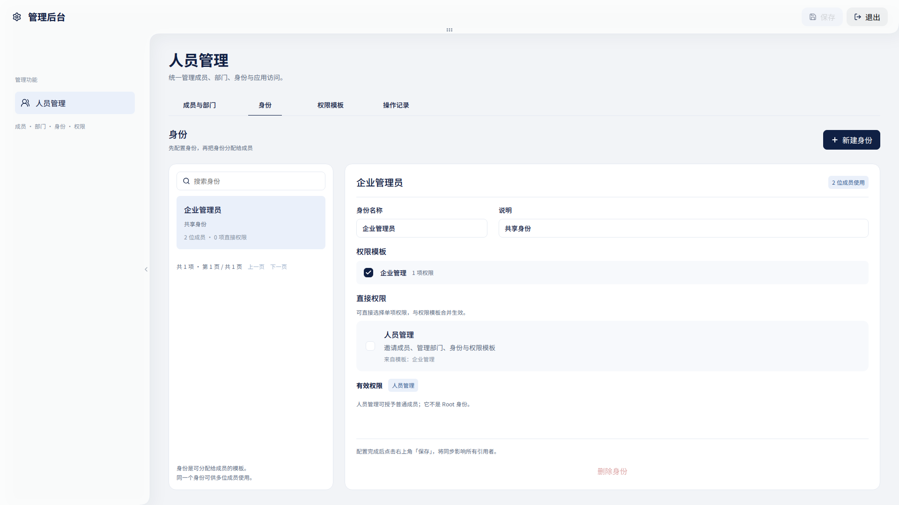
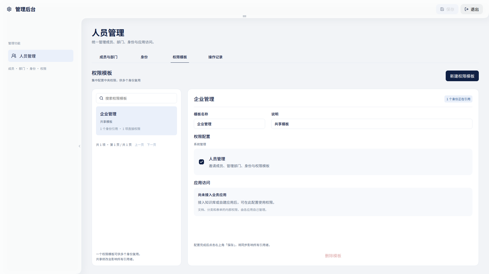
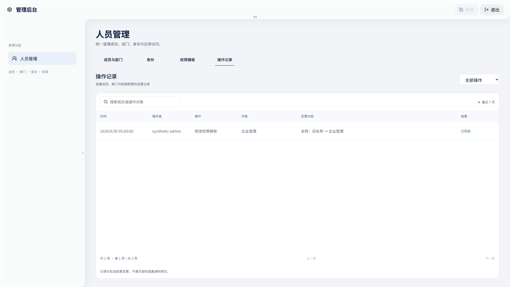

# V010-019 交付审阅

登录成功后进入 Home，导航按真实本人身份展示设置入口；刷新、退出和无权访问均使用服务端 Session。登录注册、Home、后台四视图及四种外壳状态按 Q24 批准的 Figma 原版实现。人员管理按批准 R3、ADR006 和 Q25 正式设计接入真实成员、部门、身份、权限模板及安全操作记录；部门不赋权，共享模板实时生效，Root 不绕过应用内部权限。

本页是待合并审阅记录。任务仅 ready，PR20 尚未合并，生产尚未升级。合并必须实际确认最终 head 的所有适用检查成功；历史版本的通过结果不替代最终 head。

## 实际验证及版本

| 范围 | 实际结果 | 永久材料 |
| --- | --- | --- |
| 最后两项视觉修复后的完整组件、类型、构建 | 85/85 PASS，typecheck/build exit 0 | [完整日志](full-ui-85-green.txt)、[原型 RED 快照](final-identity-result-red/manifest.json) |
| 合同、治理、底座与真实统计拓扑 | 161/161 PASS；纯文档更新 TDD:N/A | [完整日志](final-contract-governance-ready.txt) |
| Go 最终后端（2cd068b） | vet、race -p1、build PASS | [完整日志](uuid-current-go-green.txt) |
| 真实 HTTPS 全栈（1711551） | 76 组件、124 API、117 三浏览器、3 故障、8 控制、19 存储全部 PASS，610.054 秒 | [完整日志](https-final-1711551.txt)、[报告](https-final-1711551-result.json) |
| 同制品运行（9b32ab9） | 124 API、117 三浏览器、6 操作、DNS/监控/TLS/备份/完整性 PASS，692.691 秒 | [完整日志](runtime-final-9b32ab9.txt)、[报告](runtime-final-9b32ab9-result.json)、[人员恢复](runtime-personnel-recovery.json) |
| 有数据旧00001→冷热00002、固定最小角色 | 4 项真实隔离 PostgreSQL 检查 PASS | [完整日志](final-migration-roles.txt) |
| 验收后同份 OCI 转换与包装（9b32ab9） | PASS，无再次构建 | [完整日志](packaging-9b32ab9.txt) |
| 源码秘密扫描（9b32ab9） | Gitleaks PASS；未增加忽略规则 | [完整日志](gitleaks-current-9b32ab9.txt) |

[9b32ab9 完整 GitHub 产品检查](https://github.com/Hubujiu/WeaveOS/actions/runs/36689320617)实际成功，包括全栈、依赖安全、同制品运行恢复、真实增量迁移和包装。该版本不包含后续九处视觉补漏，最终提交须再次完整验证。PR 不执行仅 main 适用的交付签署步骤，不表示该步骤已经在 PR 执行。

## 原型核对

当前登录13:2、注册40:2、Home75:2、后台108:151、成员104:124、身份162:3405、模板162:3484及操作记录162:3563已实际读取高保真上下文及截图。四种外壳、原始SVG、表格选择控件、表单与离开保护、权限来源及最后按钮/页脚/筛选/结果样式均有独立用例。以下图片使用合成网络夹具，只证明可视布局，不替代真实 Session/数据库验收。

## 数据与运行边界

旧00001未改；新增兼容冷热00002，10张人员关系表及审计摘要增列。受限角色可操作人员配置、读安全活动视图及执行固定目录锁函数，不获得 Root 字段更新、中央目录写入或原始认证日志全表读取。实际并发阻塞、版本冲突、撤权先后、失败事务回滚和已提交写续期失败语义均验证。

实际备份587ms、恢复13027ms；人员关系与安全摘要恢复一致，generation改变、旧Cookie拒绝。快照后写入会丢失；这是同机隔离演练，不是异机容灾或 SLA。旧制品恢复后新人员接口404，兼容数据保留；重新激活后授权仍实时计算。

四镜像完整原始报告保留于[扫描归档](image-scan-9b32ab9.zip)，与008差异见[比较记录](image-findings-comparison.json)。公告数据库更新后 BFF231、Web387、Postgres377、Redis243项，不能称零漏洞或与旧报告完全一致。沿用 Q14 基础镜像/工具风险接受及 ADR004 当前单用户单机边界；不豁免应用源码和依赖。OpenAPI lint 退出0但仍有11项未使用/内联Schema警告，未降低检查门槛。

## 发布前剩余一步

生产只读记录见[现场](production-readonly-preflight-valid.json)：仍运行 main4f6ee76，冷热仅00001、新角色模块未安装。自动应用发布不能升级安装在服务器上的接收器自身。

按 ADR004 Q18，须单独确认并安装 receive.mjs、personnel-upgrade.mjs、roles.sql 三个固定源码文件；[精确摘要](receiver-review-hashes.json)及[安装、备份、失败恢复审阅单](../../../infra/server/deploy/V010-019-upgrade.md)已准备。安装阶段不执行 SQL 或迁移；安装验证后才合并，既有 main 自动流程备份、冷→热兼容迁移、最小角色事务和成对制品推广。许可集中登记 Q26，尚未批准或执行；既有合并发布授权不重复请求。

永久 RED→GREEN 顺序、独立预期、源码快照、命令与实际失败在[任务019](../../tasks/V010-019.md)和本目录；旧证据原字节的恢复方法见[README](README.md)。合并后仍须核对远程 main/PR 与真实部署，再完成分支、工作树及可丢弃测试产物清理。
